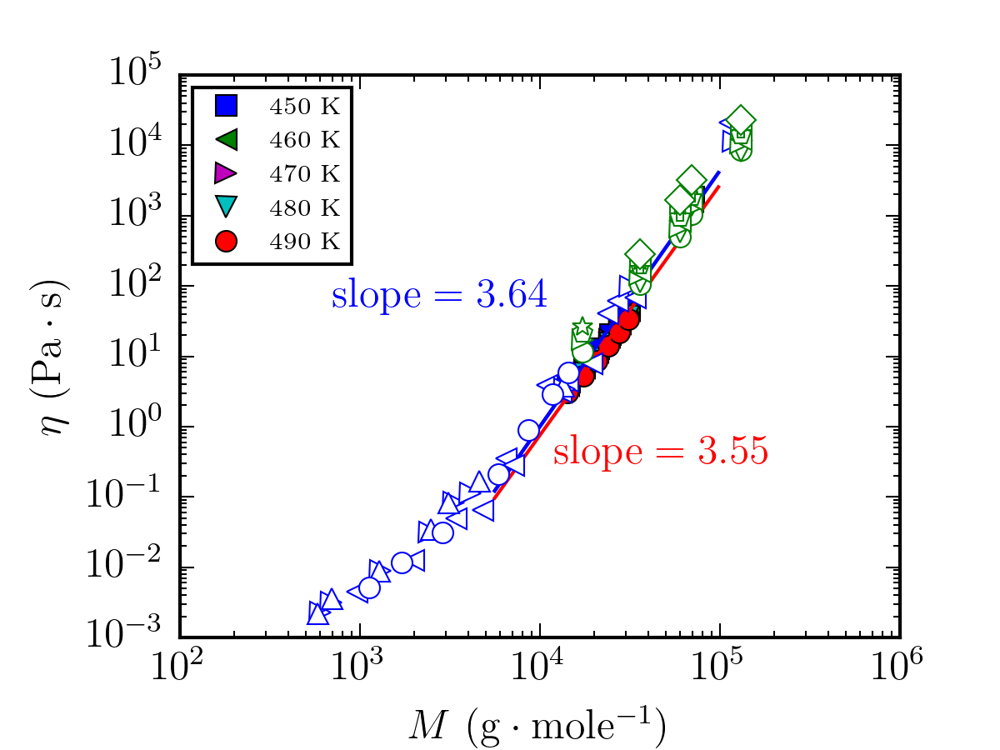

# Table of Content
- [Table of Content](#table-of-content)
- [1. Introduction](#1-introduction)
- [2. Input files](#2-input-files)
  - [2.1. Files in format `dat_{number}K.txt`](#21-files-in-format-dat_numberktxt)
  - [2.2. Files in format `data_marina{number}.txt`](#22-files-in-format-data_marinanumbertxt)
  - [2.3. Files in format `eta_l_{number}K.txt`](#23-files-in-format-eta_l_numberktxt)
  - [2.4. Files in format `data_{number}K.txt`](#24-files-in-format-data_numberktxt)
  - [2.5. Files in format `pearson_{number}.txt`](#25-files-in-format-pearson_numbertxt)
  - [2.6. Other files](#26-other-files)
- [3. Variables](#3-variables)
- [4. Debugging](#4-debugging)
  - [4.1. Function `test3_pe2.py`](#41-function-test3_pe2py)
  - [4.2 Function `fourier_poly.py`](#42-function-fourier_polypy)
  - [4.3 Function `3body.py`](#43-function-3bodypy)
  - [4.3 Function `gvdw_2body.py`](#43-function-gvdw_2bodypy)
  - [4.4 Script `./trial/1shell.sh`](#44-script-trial1shellsh)

 

# 1. Introduction

This repository contains the procedure of free volume and viscosity calculation by Jeremey Wong.
The main function is `test3_pe2.py`, and all it does is reading input files and plotting them in two figures.

Also see file `/trial/1shell.sh` for a more general info about the output of `fourier_poly.py`, `3body.py` and `gvdw_2body.py`.

# 2. Input files

Here, we list the content of the files in this repository.

## 2.1. Files in format `dat_{number}K.txt`
These files have not being used in the `test3_pe2.py` or any other function.

## 2.2. Files in format `data_marina{number}.txt`

The data in these files are included `eta` ($\eta$) vs. $logM_w$ in Figure 1. These files are data from Najm and Savvas, for $T = 443, 483K$ in `data_marina.txt` and `data_marina1.txt`. 

## 2.3. Files in format `eta_l_{number}K.txt`

The data in these files are included `eta` ($\eta$) vs. $logM_w$ in Figure 1. It is notheworthy that $\eta$ should be multiplied by a factor `exp(1458/450)*norm_fac)` and `norm_fac` is:
    
    norm_fac = 2.5*np.exp(-2000/(8.314*490))*np.exp(-2.9*4.18*1000/(8.314*490))
$\eta=N\eta_\infty exp{\left[\frac{\mathrm{\Delta E}+p_{eff}\phi^+v_c+p_{eff}\left(1-\phi^+\right)\left\langle v_{f,i}\right\rangle}{RT}\right]}\left\{1+\left[a_1+a_2\sqrt{\frac{N-2}{2F}}\left(\phi^+-F\right)\right]^{a_3}\right\}^{-a_4}$, $\Delta E = 2.9$

$\eta_\infty=\left\{\eta_0exp{\left[-\frac{\mathrm{\Delta E}+p_{eff}\phi^+v_c+p_{eff}\left(1-\phi^+\right)\left\langle v_{f,i}\right\rangle}{RT}\right]}\right\}_{T=450}$

$\eta=Aexp\left(\frac{E_a^{app}}{RT}\right)$

The `{number}K` in the filename is temperature $T$ in `K`.
These files are from theory.

## 2.4. Files in format `data_{number}K.txt`

These files are used in `eta` ($\eta$) vs. $\frac{1000}{T}$ in Figure 1 where $T$ is the temperature in celcius. The columns are $T$ and $\eta$. The `{number}K` in the filename is the molecular weight $M_w$.
These files are from by Najm and Savvas data. $\eta$ is in $Pa.s$.

## 2.5. Files in format `pearson_{number}.txt`
(except `pearson_1994.txt` where the `1994` is the year of publication)

These files are used in `eta` ($\eta$) vs. $\frac{1000}{T}$ in Figure 1. The columns are $T$ and $log_{10}\eta$. The `{number}` in the filename is the molecular weight $M_w$. The data represents Figure 2 in the Pearson 1987 paper.

## 2.6. Other files

- `padding_pe` is data published by Padding and Briels. It is in format `eta` ($\eta$) vs. $logM_w$.
- `pe_dat_ham.txt` is data published by Harmandaris et al. . It is in format `eta` ($\eta$) vs. $logM_w$.
- `pearson_pe` is data published by Pearson 1987. It is in format `eta` ($\eta$) vs. $logM_w$.
- `pearson_1994.txt`is data published by Pearson 1994. It is in format `eta` ($\eta$) vs. $logM_w$.

# 3. Variables
Except some self explanatory variables such as `rho`, `r`, `T`, `N` etc. There are variables `eta_T`, `eta_T2,.., eta_T8` that they contain the values for $\eta$ based on theory for various molecular weights $M_w$.
These variables contain the input files `eta_l_{number}K.txt`

# 4. Debugging

## 4.1. Function `test3_pe2.py`
These are the findings after debugging and understanding `test3_pe2.py`. 
- The entire code is just a simple plot. No huge calculation in it. It just reads some inpute file (mentioned above) and plot them. Even the slope of the lines in the first figure is coded by hand!!
- I modified the code in a way that the slope of each line, plotted in the first figure, will be printed in the terminal output at every run. Please check output.
- I tried to change the temperature of the in the `norm_fac` but the slope won't change.
- I believe that in this code that generates the two plots in Figure 1, there is no searious calculation regarding free volume.

 

 

   
    
  <em> Figure 1 </em>

- The results regarding free volume calculation are listed in files `eta_l_{number}K.txt` and no code in the entire `program` folder generates this format of files.

## 4.2 Function `fourier_poly.py`

This function calculates $g(r)$ from PRISM theory. The outputs are in format `g-{num1}-{num2}-py3.txt` and `g-{num1}-{num2}.png` (num1 is number of beads and num2 is temperature $T$)

## 4.3 Function `3body.py`

This function gives the $I(r)$ by considering three-body contribution to the compressibility factor in rigid chain ($R_3$):

$R_3=-\frac{\rho_b\beta}{3N}\int_{-\infty}^{\infty}drr^{-1}\int_{-\infty}^{\infty}dr^\prime\left[\frac{r^2+r^{\prime2}-\left|r-r^\prime\right|^2}{2}\right]\frac{du}{dr}g\left(r\right)g\left(\left|r-r^\prime\right|\right)\sum_{n=0}^{N-1}{\omega_{0,n}\left(r^\prime\right)}$

$I\left(r\right)=-r^3g\left(r\right)\frac{du}{dr}-2rg\left(r\right)\frac{du}{dr}\int_{-\infty}^{\infty}dr^\prime\left[\frac{r^2+r^{\prime2}-\left|r-r^\prime\right|^2}{2}\right]g\left(\left|r-r^\prime\right|\right)\sum_{n=0}^{N-1}{\omega_{0,n}\left(r^\prime\right)}$

The outputs are files `r3-2.txt` and its plot `1.png`. I have changed the `1.png` in the code to `r3-2.png` for better readability.

## 4.3 Function `gvdw_2body.py`

The first output of this file is the parameter:

$p_{eff}\phi^+v_c+p_{eff}\left(1-\phi^+\right)\left\langle v_{f,i}\right\rangle$

and its value is written in file `pressure_vol.txt`.

Another output of this file is probability $F$ = $\exp{\left(-\frac{\alpha v_i^+}{\left\langle v_{f,i}\right\rangle}\right)}$ and its value is written in file `table_result.txt`

## 4.4 Script `./trial/1shell.sh`
This is just a simple bash-script that runs functions `fourier_poly.py`, `3body.py` and `gvdw_2body.py`. 